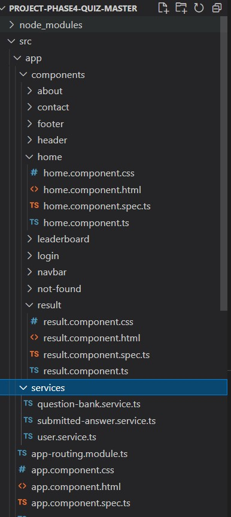
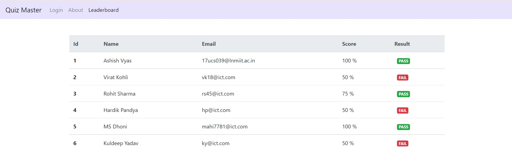

# ProjectPhase4QuizMaster

This project was generated with [Angular CLI](https://github.com/angular/angular-cli) version 12.2.11.

## Development server

Run `ng serve` for a dev server. Navigate to `http://localhost:4200/`. The app will automatically reload if you change any of the source files.

## Code scaffolding

Run `ng generate component component-name` to generate a new component. You can also use `ng generate directive|pipe|service|class|guard|interface|enum|module`.

## Build

Run `ng build` to build the project. The build artifacts will be stored in the `dist/` directory.

## Running unit tests

Run `ng test` to execute the unit tests via [Karma](https://karma-runner.github.io).

## Running end-to-end tests

Run `ng e2e` to execute the end-to-end tests via a platform of your choice. To use this command, you need to first add a package that implements end-to-end testing capabilities.

## Further help

To get more help on the Angular CLI use `ng help` or go check out the [Angular CLI Overview and Command Reference](https://angular.io/cli) page.

---
	1.1  Project Description
		1.1.2 Tech stack:	
			-> Java
			-> Springboot
			-> Angular
			-> HTML
			-> CSS
			-> Bootstrap
      			-> Hibernate
      			-> SQL
            
---
		

-> 2. Project Users Stories : ( Agile and Scrum )
---

	1. As an user I want to login for a test.
	2. As an user I want to answer questions.
	3. As an user I want to see my score and details of my test.
	4. As an user I want to see the leaderboard.
	5. As a dev I want to build login page so that we can authenticate the user for quiz.
	6. As a dev create Backend for leaderboard.
  7. As a dev create a database in SQL.

---

Sprint 1 (8 days)

  1. As an user I want to login for a test.
	2. As an user I want to answer questions.
	3. As an user I want to see my score and details of my test.
	4. As an user I want to see the leaderboard.
	5. As a dev I want to build login page so that we can authenticate the user for quiz.
	6. As a dev create Backend for leaderboard.
  7. As a dev create a database in SQL.
	
---

->3. Project git Repositories ->
---
	1. link : https://github.com/ashishav7/project-4-quiz-master-frontend.git
	2. clone git : git clone https://github.com/ashishav7/project-4-quiz-master-frontend.git
	

->4. How to run poject:
	
	4.1. Clone Project
		clone git : git clone https://github.com/ashishav7/project-4-quiz-master-frontend.git
	4.2. Database Creation
    		create a database in MYSQL Workbench with name "quiz_master"
  	4.3. Modifying "application.properties in backend"
		change username property to the username of the connection username of your SQL connection
		change password property to the password of the connection username of your SQL connection
  	4.4. 
      Run the backend springboot application
      Now run the angular application on port 4200 only

-> Source code files

	Directory Structure:
  ---
  
  
  ---
  -----

5. Some Output Screenshots
	
	**Login Screen**
	--- 
	
	---
  
  **Validations**	
	--- 
	
	---
  
  **Invalid Quiz Password **	
	--- 
	
	---
	
  **Question Screen 1**	
	--- 
	
	---
  
  **Question Screen 2**	
	--- 
	
	---
  
  **Result Page**	
	--- 
	
	---
  
  **Leaderboard**	
	--- 
	
	---
  
